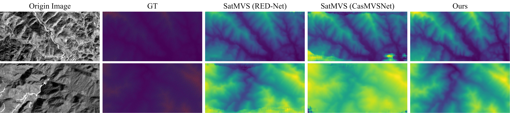

# DC-SatMVS

<div align="center">
  
</div>

The official implementation of "Surface Depth Estimation from Multi-view Stereo Satellite Images with Distribution Contrast Network”. The experimental results are available <a href="https://github.com/ZYangChen/Conv-fusion-Transformer-with-Distribution-Contrast-Loss/releases/tag/result">here</a>.

> Surface Depth Estimation from Multi-view Stereo Satellite Images with Distribution Contrast Network<br>
> [Ziyang Chen](https://zyangchen.github.io/), [Wenting Li](https://www.gzcc.edu.cn/jsjyxxgcxy/contents/3205/3569.html)✱, [Zhongwei Cui](https://tongzhan.gznc.edu.cn/info/1015/3622.htm), [Yongjun Zhang](https://orcid.org/0000-0002-7534-1219)✱ <br>
> IEEE Journal of Selected Topics in Applied Earth Observations and Remote Sensing 2025 <br>
> Correspondence: ziyangchen2000@gmail.com; 201520274@gzcc.edu.cn✱; zyj6667@126.com✱ <br>
> <a href="" target='_blank'></a>&nbsp;	


## Model Zoo
|  Dataset   | Weight  |  Condition  |
|  :----:  | :----:  |:----:  |
| WHU-TLC  | <a href="https://github.com/ZYangChen/Conv-fusion-Transformer-with-Distribution-Contrast-Loss/releases/download/checkpints/WHU_TLC.ckpt">46.7MB</a> |1 * NIVIDA A6000 |
| DTU  | <a href="https://github.com/ZYangChen/Conv-fusion-Transformer-with-Distribution-Contrast-Loss/releases/download/checkpints/DTU.ckpt">177MB</a> |4 * NIVIDA T4 |

Due to the large differences in the datasets, we use different data processing methods and different warping methods, which leads to the full version of the code being slightly different when applying our method to the two datasets as above. However, it is important to emphasize that the core design of our code is consistent.

## Data Preparation
To evaluate/train this method, you will need to download the required datasets. 
* [WHU-TLC](https://github.com/WHU-GPCV/SatMVS/blob/main/WHU_TLC/readme.md) Please rename the "open_dataset" to "open_dataset_rpc".
* [DTU (training data)](https://drive.google.com/file/d/1eDjh-_bxKKnEuz5h-HXS7EDJn59clx6V/view)
* [DTU (Depths raw)](https://virutalbuy-public.oss-cn-hangzhou.aliyuncs.com/share/cascade-stereo/CasMVSNet/dtu_data/dtu_train_hr/Depths_raw.zip)
* [DTU (testing data)](https://drive.google.com/file/d/1rX0EXlUL4prRxrRu2DgLJv2j7-tpUD4D/view?usp=sharing)

By default `dataset_root` in `train.py`, we will search for the datasets in these locations. You can create symbolic links to wherever the datasets were downloaded in the `data` folder

```Shell
├── data
    ├── TLC
        ├── Open
        ├── open_dataset_pinhole
        ├── open_dataset_rpc
    ├── DTU
        ├── mvs_training
            ├── Cameras
            ├── Depths
            ├── Depths_raw
            ├── Rectified
        ├── dtu_test
```

## Environment Preparation
```Shell
conda create -n DCSat python=3.7
conda activate DCSat
wget -c https://www.sqlite.org/2021/sqlite-autoconf-3340100.tar.gz
tar -xvf sqlite-autoconf-3340100.tar.gz
cd sqlite-autoconf-3340100
vim sqlite3.c
```
Add macros under "include"
```Shell
#define SQLITE_CORE 1
#define SQLITE_AMALGAMATION 1
#ifndef SQLITE_PRIVATE
# define SQLITE_PRIVATE static
#endif
#define SQLITE_ENABLE_COLUMN_METADATA 1        //Please pay attention to this line
 
/************** Begin file ctime.c *******************************************/
/*
```
recompile
```Shell
./configure
make
sudo make uninstall
sudo make install
#Verify that the installation was successful
sqlite3 --version
```
Download proj (version 6.3.2) source code, unzip it and compile and install it
```Shell
proj-5.2.0
wget https://download.osgeo.org/proj/proj-6.3.2.tar.gz
tar -zxvf proj-6.3.2.tar.gz
#Go to the directory and compile
cd proj-6.3.2
./configure
make
make install
ldconfig
proj --version
```
Download geos (version 3.8.1), unzip it, compile and install it.
```Shell
wget http://download.osgeo.org/geos/geos-3.8.1.tar.bz2
tar -jxvf geos-3.8.1.tar.bz2
cd geos-3.8.1
./configure
make
make install 
ldconfig
geos-config --version
```
gdal(2.4.2)
```Shell
pip install setuptools==57.5.0
sudo add-apt-repository ppa:ubuntugis && sudo apt update
sudo apt install gdal-bin
gdalinfo --version  # 假设输出为2.4.2
```
```Shell
pip install gdal==2.4.2.*
```
or
```Shell
wget -c http://download.osgeo.org/gdal/2.4.2/gdal-2.4.2.tar.gz
tar -zxvf gdal-2.4.2.tar.gz
cd /gdal-2.4.2/swig/python/
python setup.py build
python setup.py install
```
```Shell
python
from osgeo import gdal
```
```Shell
pip install torch==1.7.1+cu110 torchvision==0.8.2+cu110 torchaudio==0.7.2 -f https://download.pytorch.org/whl/torch_stable.html
pip install tensorboardX
pip install matplotlib
pip install opencv-python
pip install imageio
```

## Train

Train on WHU-TLC dataset using RPC warping:

`python train.py --mode="train" --model="red" --geo_model="rpc" --dataset_root=[Your dataset root] --batch_size=1 --min_interval=[GSD(resolution of the image)] --gpu_id="0"`

Train on WHU-TLC dataset using homography warping:

`python train.py --mode="train" --model="red" --geo_model="pinhole" --dataset_root=[Your dataset root] --batch_size=1 --min_interval=[GSD(resolution of the image)] --gpu_id="0"`

### Predict
If you want to predict your own dataset, you need to If you want to predict on your own dataset, you need to first organize your dataset into a folder similar to the WHU-TLC dataset. And then run:

`python predict.py --model="red" --geo_model="rpc" --dataset_root=[Your dataset] --loadckpt=[A checkpoint]`

